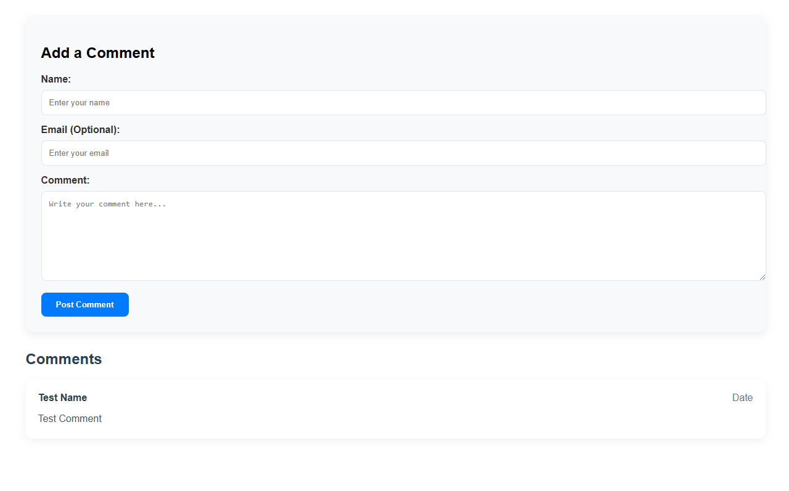

# Comments Manager for Static Website

Web app hosted on vercel and connected to PostgreSQL database on [https://supabase.io/](https://supabase.io/) for adding and displaying comments on static websites.

Every comment added will be added to a list of comments to be moderated, which can be approved/deleted from the moderator dashboard.

## Presents the following routes:

### /api/get-comments

returns the following html content



To include this in your website, add a div with id 'comments-div' to the html and the following to the js

```javascript
async function fetchComments() {
  const commentsDiv = document.getElementById('comments-div');
  
  try {
      const response = await fetch('https://<vercel hosting subdomain>.vercel.app/api/get-comments');
  
      if (!response.ok) {
          throw new Error(`HTTP error! status: ${response.status}`);
      }
  
      const htmlContentText = await response.text();
      const parser = new DOMParser();
      const htmlContent = parser.parseFromString(htmlContentText, 'text/html');
      const comments = htmlContent.querySelector('#comments-container');
      const style = htmlContent.querySelector('style');
      const script = htmlContent.querySelector('script');
  
      console.log('Comments:', comments);
      // Safely insert the HTML content
      commentsDiv.innerHTML = comments.innerHTML;
      const newScript = document.createElement('script');
      newScript.text = script.innerText;
      document.head.appendChild(newScript);
      const newStyle = document.createElement('style');
      newStyle.innerHTML = style.innerHTML;
      document.head.appendChild(newStyle);
  
  } catch (error) {
      console.error('Error fetching comments:', error);
      commentsDiv.innerHTML = `
          <div class="error">
              Sorry, there was an error loading the comments. Please try again later.
          </div>
      `;
  }
}

fetchComments();
```

### /dashboard

returns a moderator dashboard which lists the unapproved comments and provides options to approve/delete comment

## How to host

- Clone this repository and connect it to vercel project to host it on vercel.
- Create an account on [https://supabase.io/](https://supabase.io/) and create a postgresql database, and disable its Row-Level Security (RLS).
- Add the `SUPABASE_URL` and `SUPABASE_KEY` to the environment variables on vercel, along with `ADMIN_PASSWORD_HASH` key containing the sha256 hash of your password.
- Add the above given js on your website to get the comments
